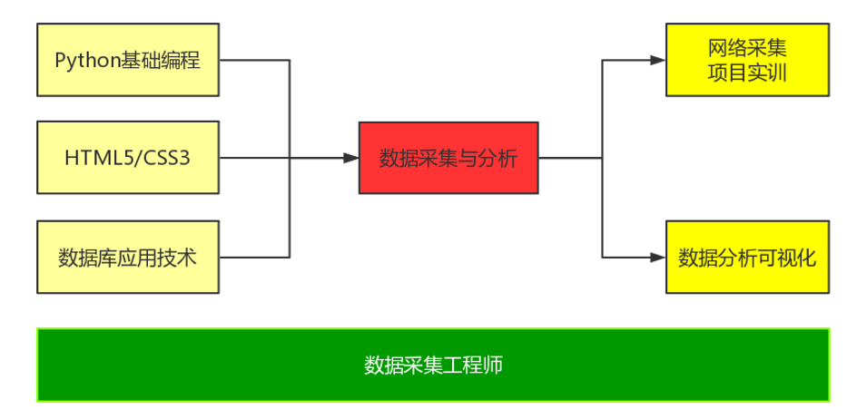
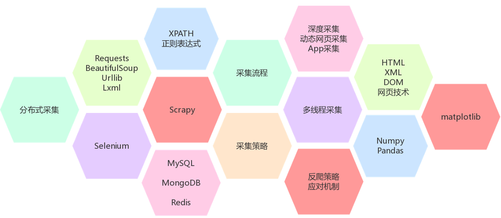
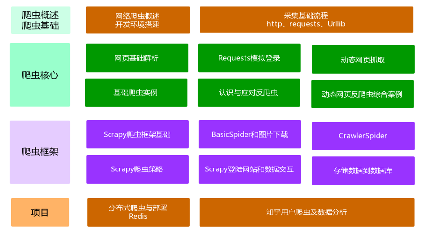
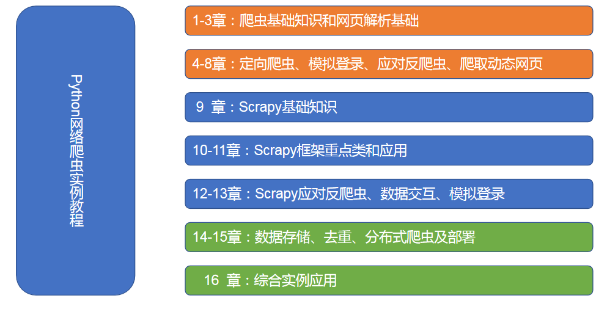
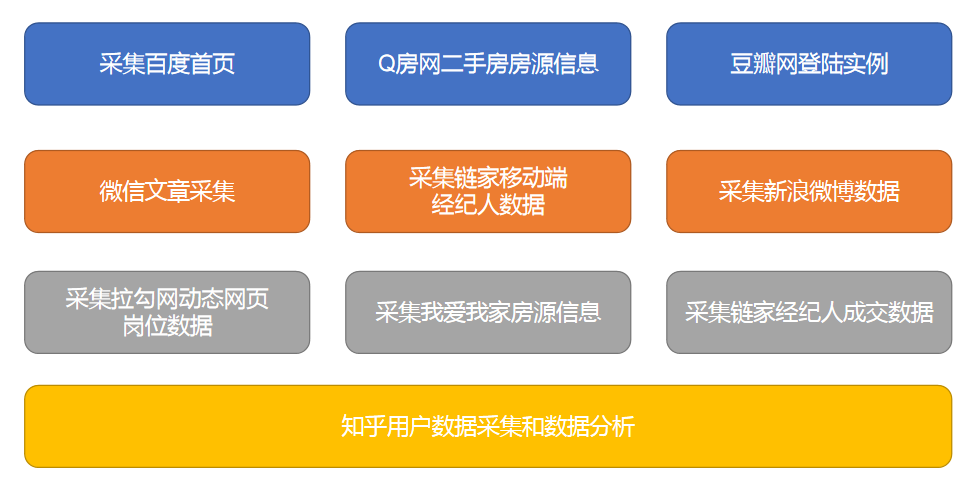
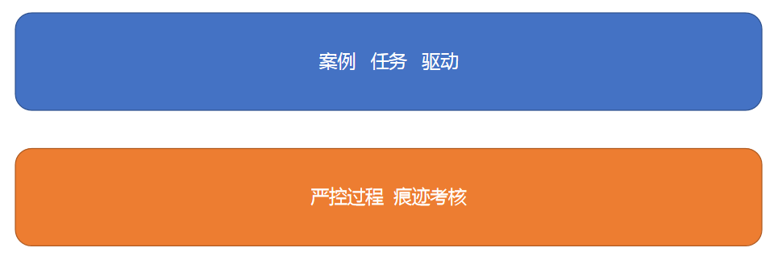
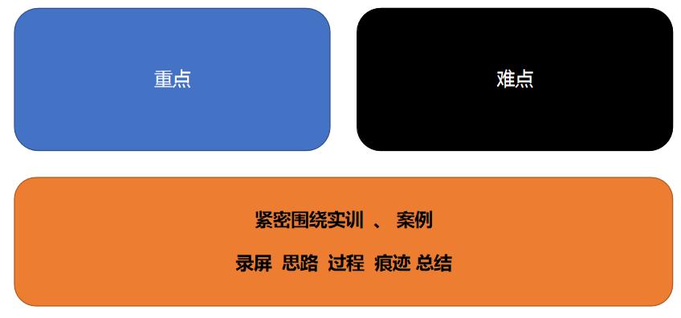
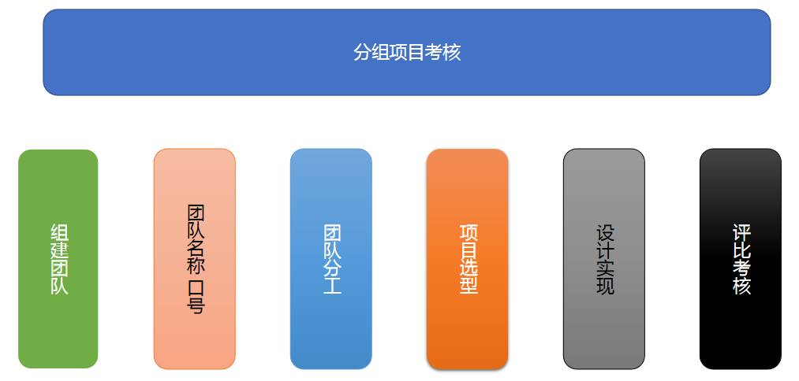
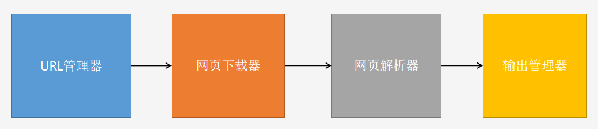

# 认识课程

## 课程地位

该课程主要面向职位方向为：数据采集 数据爬取工程师

该课程在课程体系中的前驱课程为：

	- Python 基础编程
	- HTML5/CSS3
	- 数据库应用技术

该课程在课程体系中的后续课程为：

- 网络采集项目实训
- 数据可分析可视化

## 课程应掌握能力

明确课程主要职业面向为数据采集、数据爬取工程师，该职位在企业招聘和实际工作应用中主要涉及以下知识能力：

- 配合架构团队完成爬虫方向信息系统规划与落地
- 负责爬虫团队的技术架构实施和技术管理
- 推进数据采集(爬虫)团队的研发落地，负责设计和开发分布式网络爬虫系统
- 进行多平台信息的抓取和分析工作解决数据爬虫的核心问题
- 把握网络爬虫核心技术研究方向，研究优化算法，提升爬虫系统的稳定性、可扩展性
- 精通web抓取原理及技术，从结构化和非机构化数据中获取信息
- 保障采集的数据按时、准确、稳定的输出
- 负责网页信息和APP数据抽取、清洗、消重等工作，提升平台的抓取效率
- 参与爬虫核心算法和策略优化，熟悉采集系统的调度策略
- 负责大数据产品所需网站的信息抓取、解析、清洗等研发与优化工作
- 负责设计和开发分布式网络爬虫，进行多平台、多终端信息的抓取和分析
- 设计爬虫策略和防屏蔽规则，解决封账号、封IP、验证码等难点攻克
- 系统解决动态网页内容抓取、深度网页内容抓取、API接口数据爬取
- 实现数据提取、清洗、结构化、入库、统计分析等需求
- 精通爬虫和反爬技术，精通http底层协议

## 课程主要内容

课程主要内容由简入繁分四个阶段，在每个阶段中都以项目、案例进行驱动，分别为：

- 爬虫基础知识
- 爬虫核心知识
- 爬虫框架掌握
- 综合案例应用

## 课程教材剖析

将教材内容分割成三部分进行分段讲解：

- 第一阶段：网络爬虫基础和核心知识
- 第二阶段：网络爬虫框架知识和应用
- 第三阶段：分布式网络爬虫和综合应用

## 课程主要案例

该课程中会涉及到在线主流、常用的站点数据采集，跨不同的行业和不同的平台应对复杂的数据环境进行采集，主要案例如下图：

## 课程授课方式

授课主要以项目、案例、任务模式进行驱动，严格控制过程化、痕迹化管理，强调重点、难点，从实践入手加强对理论知识和实际工作中的技能进行应用和锻炼。

## 课程考核

考核分平时过程化考核成绩+综合项目评比进行综合考核。

# 网络爬虫概述

## 认识网络爬虫

### 网络爬虫含义

网络爬虫：是一种按照一定的规则，自动地抓取互联网中在线数据信息的程序或者脚本。

通俗易懂的讲就是用程序语言（python）自动化的从互联网中采集用户需要的目标数据。

### 网络爬虫主要类型

- 通用网络爬虫

  通常指以一个关键词采集整个网络资源数据，强调广泛性（面）的采集，如大型门户数据（如新浪微博、为微信等）、搜索引擎（百度、谷歌等）数据采集。

- 聚焦网络爬虫：

  通常指以某一个主题、某些特殊领域相关数据的采集，强调是以点进行数据采集，相应的涉及的数据量相对较少。

- 增量式网络爬虫：

  通常指在随着时间的推移只采集变化更新的部分数据，和数据库中的增量备份类似的概念。

- 深层次页面爬虫：

  通常指对某些数据进行深层次的数据进行采集，比如我们进入一个站点A来到列表页面，点击列表页面进入详情页B，在详情页中点击链接C进入另外一个页面......在这里资源链接B和C的数据均来自A，如果是深层次页面数据采集我们根据需要可能采集A-B-C-D等相关数据。

### 网络爬虫架构

网络爬虫架构简单理解就是用程序去模拟我们平时上网查找数据一样的过程，只不过不是我们手动去操作，二手交给程序自动化的去执行，主要涉及到以下几个步骤：

- URL管理器

  管理要采集哪些链接地址（URL简单理解就是网页的地址：如https://www.baidu.com/）。

- 网页下载器

  当我们明确需要采集哪些url地址内容后，就用程序模拟请求向这个地址发起请求得到响应内容。

- 网页解析器

  在上面过程中得到响应内容后，是得到的所有内容，我们可能需要的只是其中部分数据，所以需要对得到的所有数据进行解析抽取出我们想要的目标数据。

- 输出管理器

  当我们得到了目标数据后需要对它进行管理，可以是输出到文件，或是存入数据库，或是展现在页面中等对目标数据进行管理。

### 网络爬虫应用场景

网络数据采集在大数据应用方面十分广泛，在搜索引擎、数据分析、数据挖掘、电商行业、广告投入等方面广泛运用。

## 网络爬虫技术实现

### Python中的HTTP请求实现

主要掌握两个模拟http请求的技术：

- Urllib
- requests

上面两者中在应用中requests相对Urllib应用得更为广泛

### Python中的实现网页解析

网页解析器中涉及的主要技术：

- 正则表达式
- lxml库
- Beautiful Soup

三者中使用得比较广泛的是lxml库，其次是正则表达式，最好是BeautifulSoup

### Python爬虫框架

本课程中主要讲解Scrapy框架，其他的爬虫框架还有Pyspider、Cola等。

## 搭建开发环境

我们授课过程中的开发环境以Anaconda+Pycharm进行开发，软件的安装在前面Python数据分析课程中已经有讲解，大家笔记本上都已经安装好对应的开发环境，在后面学习过程中需要用到第三方的其他库，我们用到时再一一安装。

如果环境有问题不知道如何安装请参考安装视频《Anaconda-PyCharm安装过程.avi》

# 作业

- 安装好相应的开发环境
- 熟知网络爬虫架构实现步骤
- 熟知网络爬虫架构中相关的技术