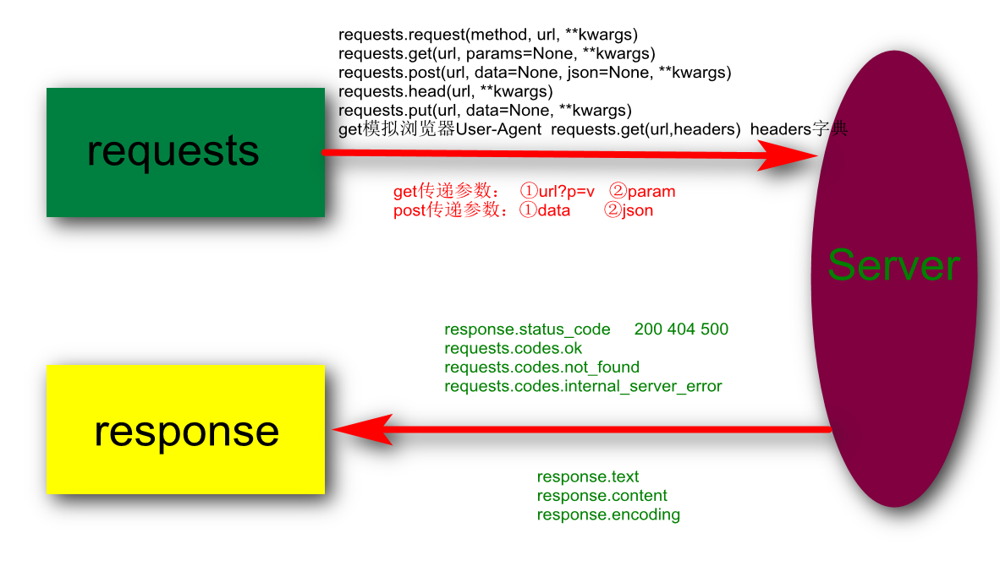

# Requests库入门

## requests库的安装

1. 检查是否安装requests库  pip show requests

   ```
   pip show requests
   如果已经安装则会罗列对应的信息
   ```

   ```
   C:\Users\Administrator>pip show requests
   Name: requests
   Version: 2.22.0
   Summary: Python HTTP for Humans.
   Home-page: http://python-requests.org
   Author: Kenneth Reitz
   Author-email: me@kennethreitz.org
   License: Apache 2.0
   Location: c:\anaconda3\lib\site-packages
   Requires: idna, urllib3, certifi, chardet
   Required-by: Sphinx, conda, conda-build, anaconda-project, anaconda-client
   ```

2. 如果没有安装则安装

   ```
   pip install requests
   ```


## requests请求页面

1. requests请求

   [api参考网址](https://2.python-requests.org//zh_CN/latest/api.html)

   ```
   requests.request(method, url, **kwargs)
   ```

   上面api的理解：

   - method参数表示发起http的请求方式（get post head put delete option 等），常用的是get和post

   - url则是请求的目标地址

   - kwargs 其他的参数，**表示不定长的参数，在调用的时候根据实际情况传入对应的参数

     常见的有 params、data、json、headers、cookies、timeout等 

     params通常适用get请求，data json通常适用于post请求

   - params、data、json、headers参数常用的值是字典或字符串

   ```
   一旦理解上面方法，下面方法就很好理解
   requests.get(url, params=None, **kwargs)
   requests.post(url, data=None, json=None, **kwargs)
   requests.head(url, **kwargs)
   requests.put(url, data=None, **kwargs)
   .....
   ```

## requests响应

requests响应

```
import requests
response = requests.get("https://www.baidu.com/")
response_text = response.text
response_content = response.content
response_encoding = response.encoding
print(response_text)
print(response_content)
print(response_encoding)
```

代码理解：

- requests发起的所有请求返回值对象都是response
- response返回的内容可以通过text和content属性进行获取
- response.text和response.content的区别在于前者返回文本，后者以字节方式返回
- 如果请求一张图片回来直接保存则用response.content
- 可以获取返回内容的字符集或者重新设定字符集

requests响应状态码

```
import requests

# requests请求后，response响应后对应的响应码
# 常见的200 404 500  所有的状态码都存放在requests.codes中
# 通常用response.status_code的响应码和requests.codes码进行对比做逻辑判断
ok = requests.codes.ok
not_found = requests.codes.not_found
internal_server_error = requests.codes.internal_server_error
print("正常响应码：{0}   资源文件不存在：{1}    服务器内部错误：{2}".format(ok, not_found, internal_server_error))
response = requests.get("https://www.baidu.com/")
status_code = response.status_code
if status_code == ok:
    print("向百度请求正常响应..........")
```

代码理解：

- requests请求后，response响应后对应的响应码
- 常见的200 404 500  所有的状态码都存放在requests.codes中
- 通常用response.status_code的响应码和requests.codes码进行对比做逻辑判断

## requests请求头部

```
import requests
headers = {
    "User-Agent": "Mozilla/5.0 (Windows NT 6.1; Win64; x64) AppleWebKit/537.36 (KHTML, like Gecko) Chrome/78.0.3904.108 Safari/537.36"
}
response = requests.get("https://www.baidu.com/", headers=headers)
print(response.status_code)
request_headers = response.request.headers
print(request_headers)
```

代码理解：

- 通常我们访问服务器资源，通过浏览器代理User-Agent访问
- 我们可以通过请求时模拟头部headers来模拟为浏览器请求，而不是爬虫
- 发起请求后也可以再去查看当前请求对应的头部信息

## requests重定向和超时

```
import requests
response = requests.get("http://www.jd.com/",timeout=3)
print(response.history, response.url)
```

- 当我们访问京东http://www.jd.com/时会自动重定向到https://www.jd.com/
- requests会自动重定向到https对应的链接
- 可以用response.history来访问重定向到的那个页面
- 通过timeout可以设置超时时间

## requests请求传递参数

```
import requests
response = requests.get("https://www.douban.com/search?q=python")
print(response.url)
response = requests.get("https://www.douban.com/search", params={"q": "python"})
print(response.url)

输出：
https://www.douban.com/search?q=python
https://www.douban.com/search?q=python
```

- 上面代码在get请求时对应的params参数

## 总结




# Urllib库入门

## Urllib库介绍

Urllib库主要由四部分组成：

- urllib.request
- urllib.error
- urllib.parse
- urllib.robotparse

## 发送Get请求

### urllib.request

  ```
import urllib.request as request
# 发起request请求 返回response  http.client.HTTPResponse
response = request.urlopen("https://www.baidu.com/")
# 在http.client.HTTPResponse对象中可以获取到对应的url status 以及读取数据的方法read()
# read()方法返回一个二进制的比特流 0101  但是不方便阅读所以自动给我们转换成了 b'<html>\r\n<head  这种格式
bytes_data = response.read()
# 对字节流进行解码转换成字符串
print(bytes_data.decode("utf-8"))
  ```


[知识回顾：str和bytes类型](https://blog.csdn.net/amorhuang/article/details/82502773)

### urllib.parse

```
import  urllib.parse as parser
import  urllib.request as request
paras = {"page":1,"page_num":10}
# 将字典数据转换成参数形式的字符串 page=1&page_num=10
paras_data = parser.urlencode(paras)
# 发起请求
response = request.urlopen("https://www.baidu.com?"+paras_data)
print(response.status)
print(response.url)

```

urllib.parse(dict_data) 	将字典数据转换成参数形式的字符串

## 模拟浏览器发送GET请求

```
import urllib.request as request

# 模拟浏览器头部
headers = {
    "User-Agent": "Mozilla/5.0 (Windows NT 6.1; Win64; x64) AppleWebKit/537.36 (KHTML, like Gecko) Chrome/78.0.3904.108 Safari/537.36"
}
# 创建一个带有头部的request请求
req = request.Request("https://www.baidu.com", headers=headers)
# 发起请求 返回响应
response = request.urlopen(req)
print(response.read().decode())

```

## 发送POST请求

```
from urllib import request, parse
# 需要传递的post参数
post_data = parse.urlencode([("key1", "value1"), ("key2", "value2")])
print(post_data)  # key1=value1&key2=value2
# 模拟一个浏览器请求
req = request.Request("https://www.baidu.com")
# 添加请求头部
req.add_header("User-Agent",
               "Mozilla/5.0 (Windows NT 6.1; Win64; x64) AppleWebKit/537.36 (KHTML, like Gecko) Chrome/78.0.3904.108 Safari/537.36")
# 发起post请求  注意这里data传递的参数必须是bytes类型
response_data = request.urlopen(req,data=post_data.encode('utf-8')).read().decode()
print(response_data)
```

post请求依然是用request.urlopen(url,data)进行请求，**data数据必须是bytes类型**

## URL解析

### urlparse

将url解析成6个部分

### urlunparse

反向urlparse组合

### urljoin

# 作业

一个完整的url由哪些部分组成，分别表示什么含义

requests库请求百度首页打印出响应的内容

urllib库使用get和post请求完成对百度首页的访问并打印输出响应内容

