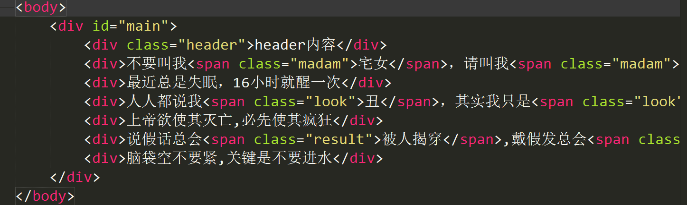
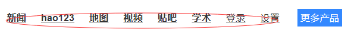

# 网页解析概述

**request请求**----**返回响应**----**html代码**----**网页解析器**---**抽取目标数据**

网页解析器：

- 正则表达式
- Lxml库
- Beautiful Soup

# XPath语法基础

## Lxml库的安装

Lxml不是python标准库，需要安装

查看是否已经安装:

```
pip show lxml
```


如未安装，进行安装。

### 在线安装

```
pip install lxml
```

### 离线安装

- 下载whl程序包

- 命令执行安装

  ```
  pip install **********.whl
  ```

## XPath语法基础

### XPath是什么

**XPath 是一门在 XML 文档中查找信息的语言。XPath 可用来在 XML 文档中对元素和属性进行遍历。**

### XPath用在哪

**从目标xml内容中抽取自己想要的部分内容，主要获取的对象：**

- 元素节点

- 属性节点

- 文本节点

  

  

### XPath语法

xpath是一个字符串，从根(**/**)开始，后面紧跟你需要查找的路径

举例：**/**/body/div/div[1]/text()

​		  从/开始找body下的div下的第一个div的文本内容，下标从  **0 ** 开始	

### XPath查找元素

#### html代码



```
	<body>
		<div id="main">
			<div class="header">header内容</div>
			<div>不要叫我<span class="madam">宅女</span>，请叫我<span class="madam">居里夫人</span></div>
			<div>最近总是失眠，16小时就醒一次</div>
			<div>人人都说我<span class="look">丑</span>，其实我只是<span class="look">美</span>得不明显</div>
			<div>上帝欲使其灭亡,必先使其疯狂</div>
			<div>说假话总会<span class="result">被人揭穿</span>,戴假发总会<span class="result">被风揭穿</span></div>
			<div>脑袋空不要紧,关键是不要进水</div>
		</div>
	</body>
```

#### 通过属性查找元素

需求：上面html代码找到属性class为header的元素内容

xpath：**//div/div[@class=“header”]/text()**


#### 提取属性值

- 提取标签内文本内容：在xpath中取得元素基础上最后用 **text()**

- 提取元素属性对应值：在xpath中取得元素基础上最后用**@属性名**

需求：取得上面代码中所有span标签的额class属性值

xpath：**/div/span/@class**


#### 高级用法

更多xpath语法可以参考网络资源[W3School](https://www.w3school.com.cn/xpath/index.asp)

案例：

| 表达式   | 描述                                                       |
| :------- | :--------------------------------------------------------- |
| nodename | 选取此节点的所有子节点。                                   |
| /        | 从根节点选取。                                             |
| //       | 从匹配选择的当前节点选择文档中的节点，而不考虑它们的位置。 |
| .        | 选取当前节点。                                             |
| ..       | 选取当前节点的父节点。                                     |
| @        | 选取属性。                                                 |


| bookstore       | 选取 bookstore 元素的所有子节点。                            |
| --------------- | ------------------------------------------------------------ |
| /bookstore      | 选取根元素 bookstore。注释：假如路径起始于正斜杠( / )，则此路径始终代表到某元素的绝对路径！ |
| bookstore/book  | 选取属于 bookstore 的子元素的所有 book 元素。                |
| //book          | 选取所有 book 子元素，而不管它们在文档中的位置。             |
| bookstore//book | 选择属于 bookstore 元素的后代的所有 book 元素，而不管它们位于 bookstore 之下的什么位置。 |
| //@lang         | 选取名为 lang 的所有属性。                                   |

| 路径表达式                         | 结果                                                         |
| :--------------------------------- | :----------------------------------------------------------- |
| /bookstore/book[1]                 | 选取属于 bookstore 子元素的第一个 book 元素。                |
| /bookstore/book[last()]            | 选取属于 bookstore 子元素的最后一个 book 元素。              |
| /bookstore/book[last()-1]          | 选取属于 bookstore 子元素的倒数第二个 book 元素。            |
| /bookstore/book[position()<3]      | 选取最前面的两个属于 bookstore 元素的子元素的 book 元素。    |
| //title[@lang]                     | 选取所有拥有名为 lang 的属性的 title 元素。                  |
| //title[@lang='eng']               | 选取所有 title 元素，且这些元素拥有值为 eng 的 lang 属性。   |
| /bookstore/book[price>35.00]       | 选取 bookstore 元素的所有 book 元素，且其中的 price 元素的值须大于 35.00。 |
| /bookstore/book[price>35.00]/title | 选取 bookstore 元素中的 book 元素的所有 title 元素，且其中的 price 元素的值须大于 35.00。 |


| 通配符 | 描述                 |
| :----- | :------------------- |
| *      | 匹配任何元素节点。   |
| @*     | 匹配任何属性节点。   |
| node() | 匹配任何类型的节点。 |


| 路径表达式   | 结果                              |
| :----------- | :-------------------------------- |
| /bookstore/* | 选取 bookstore 元素的所有子元素。 |
| //*          | 选取文档中的所有元素。            |
| //title[@*]  | 选取所有带有属性的 title 元素。   |


| 路径表达式                       | 结果                                                         |
| :------------------------------- | :----------------------------------------------------------- |
| //book/title \| //book/price     | 选取 book 元素的所有 title 和 price 元素。                   |
| //title \| //price               | 选取文档中的所有 title 和 price 元素。                       |
| /bookstore/book/title \| //price | 选取属于 bookstore 元素的 book 元素的所有 title 元素，以及文档中所有的 price 元素。 |


如果元素标签有多级嵌套，想要取元素里面的内容：

需求：取id为main的div的内容

xpath: string(/div/元素...)


更多xpath语法请参考文档资料

# Beautiful Soup库和正则表达式

操作的html字符串

```
html = """
 	<body>
		<div id="main">
			id为main的内容
			<div class="header">header内容</div>
			<div>不要叫我宅女，请叫我居里夫人</div>
			<div>最近总是失眠，16小时就醒一次</div>
			<div>人人都说我丑，其实我只是美得不明显</div>
			<div>上帝欲使其灭亡,必先使其疯狂</div>
			<div>说假话总会被人揭穿,戴假发总会被风揭穿</div>
			<div>脑袋空不要紧,关键是不要进水</div>
			<ul>
			    <li><a href="demo.xml">跳转</a></li>
			    <li><a href="demo3.xml">跳转3</a></li>
			</ul>
		</div>
	</body>
"""
```


## BeautifulSoup基本用法

### 创建BeautifulSoup对象

**BeautifulSoup(html, 'lxml')**

```
from bs4 import BeautifulSoup
# bs4解析器调用BeautifulSoup的构造方法将字符串转换成BeautifulSoup文档对象
soup = BeautifulSoup(html, 'lxml')
```


### 获取文档对象元素

**标签对象 = BeautifulSoup对象.标签名**

```
# 可以通过soup对象直接访问html的文档节点对象  文档对象.元素名
first_div = soup.div  # 返回文档对象的第一个div对象 注意返回的是带有标签结构的内容
a_tag = soup.ul.li.a  # 返回第一个ul对象的第一个li标签对象下的第一个a标签对象
```

### 获取元素内容

**标签对象.string**

**标签对象.get_text()**

```
tag_content = a_tag.string  # 返回标签对象中文本内容  跳转
tag_content2 = a_tag.get_text()  # 返回标签对象中文本内容第二种方式  跳转
```

### 获取元素属性

**标签对象['属性名']**

**标签对象.get('属性名')**

```
tag_attr = a_tag['href']  # 返回标签对象的属性 demo.xml
tag_attr2 = a_tag.get('href')  # 返回标签对象的属性第二种方式 demo.xml
```

## BeautifulSoup标准选择器find_all方法

html结构数据：

```
 	<body>
		<div id="main">
			id为main的内容
			<div class="header">header内容</div>
			<div>不要叫我宅女，请叫我居里夫人</div>
			<div>最近总是失眠，16小时就醒一次</div>
			<div>人人都说我丑，其实我只是美得不明显</div>
			<div>上帝欲使其灭亡,必先使其疯狂</div>
			<div>说假话总会被人揭穿,戴假发总会被风揭穿</div>
			<div>脑袋空不要紧,关键是不要进水</div>
			<ul>
			    <li><a href="demo.xml">跳转</a></li>
			    <li><a href="demo3.xml">跳转3</a></li>
			</ul>
		</div>
	</body>
```


### 查找所有指定节点

**BeautifulSoup对象.find_all('标签名')**

```
from bs4 import BeautifulSoup
# bs4解析器调用BeautifulSoup的构造方法将字符串转换成BeautifulSoup文档对象
soup = BeautifulSoup(html, 'lxml')
# 根据标签名查找所有对应的元素
all_div = soup.find_all('div')
```

### 根据下标查找某节点

在上面基础上可以结合下标  **[index]** 查找指定某个元素，index从0开始

```
# 根据下标查找指定某个元素
div_1 = soup.find_all('div')[1]
```

### 获取节点文本

同上基本用法

```
# 获取元素文本内容
print(div_1.string)
print(div_1.get_text())
```

### 根据属性查找节点

根据属性查找节点

- 通过attrs可以传入多属性字典对象过滤元素
- 直接通过class样式查找元素
- 直接通过id查找指定元素

```
# 根据属性查找元素节点
div_by_attr = soup.find_all(attrs={'class': 'header'})[0]
div_by_class = soup.find_all(class_='header')  # 注意class有一个下划线
div_by_id = soup.find_all(id='main')
```

## 正则表达式

### 什么是正则表达式

规则性字符串

规则性：语法

### 正则表达式的作用

从繁杂的大量字符串中快速、高效匹配目标字符串

### re模块的常用函数

```
import re

# match函数从字符串起始位置开始匹配 匹配不成功返回None,匹配成功返回re.Match对象
result = re.match(r'he', 'hello python')
# search函数返回字符串中第一个与正则表达式匹配的re.Match对象 re.I忽略大小写
result = re.search(r'python', 'hello:Python,python is a program language', re.I)
# split将制定字符串按照正则表达式进行分割
result = re.split(r"-", "hello-python-lol-java")
# findall以列表形式返回全部与正则表达式匹配的字符串
result = re.findall(r"\d+", "hello lucy,age=20,salary=20000")
# sub将与正则表达式匹配的字符串用制定字符串替换掉，返回替换后的字符串
result = re.sub(r"lol", "python", "i like lol, lol is so interesting...")
# compile将正则表达式字符串转换成正则表达式对象Pattern 执行效率更高
pattern = re.compile(r'\d+')
result = re.findall(pattern, '147a258b369c')
print(result)
```

# 实训主题

## 实训内容

### 给定html片段

```
	<body>
		<div id="main">
			id为main的内容
			<div class="header">header内容</div>
			<div>不要叫我<span class="madam">宅女</span>，请叫我<span class="madam">居里夫人</span></div>
			<div>最近总是失眠，16小时就醒一次</div>
			<div>人人都说我<span class="look">丑</span>，其实我只是<span class="look">美</span>得不明显</div>
			<div>上帝欲使其灭亡,必先使其疯狂</div>
			<div>说假话总会<span class="result">被人揭穿</span>,戴假发总会<span class="result">被风揭穿</span></div>
			<div>脑袋空不要紧,关键是不要进水</div>
		</div>
	</body>
```

### 获取指定元素

需求：

- 获取所有div元素
- 获取id为main的div元素
- 获取id为main的第二个子div元素的内容

### 获取指定属性

需求：获取所有span元素的class属性值

### 获取内容

需求：

- 获取所有div元素内容
- 获取所有span元素内容

### 获取百度数据

- 获取百度首页头部所有链接文字

- 获取百度首页头部所有链接

  

  

