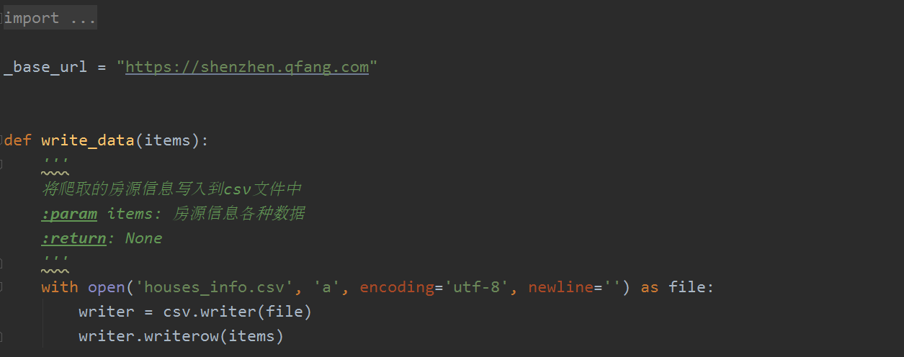
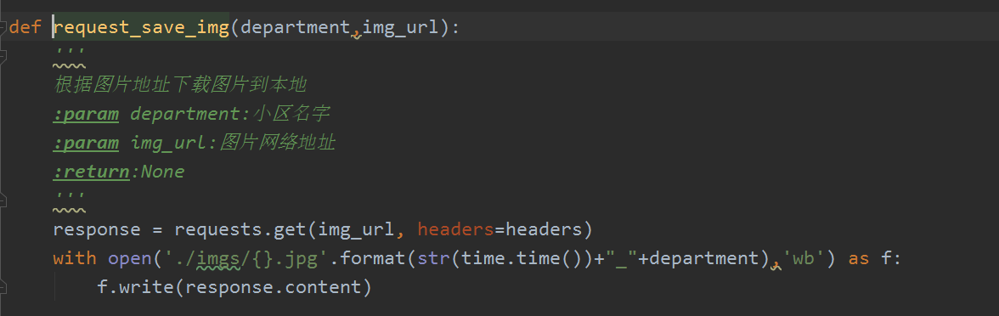

# 线程和进程

线程和进程的理解

CPU密集型任务---进程

IO密集型任务--线程

# 实训主题

## Q房网爬虫实例

### 任务描述

抓取二手房源前10页房源信息，主要包括房源标题 、户型、面积、楼层、朝向、价格等

[Q房网地址](https://shenzhen.qfang.com/sale)

### 思路分析

- 分析二手房源链接
- 分析单个房源信息
- 抽取目标数据
- 保存数据到csv

### 实现过程

- 模拟请求头（user-agent	cookie）

- 构建url地址

- requests发起请求

- 处理response响应

- xpath抽取结构数据

- 写入文件

  [参考代码]([https://github.com/crawler01/spider_class/blob/master/04-%E5%9F%BA%E7%A1%80%E7%88%AC%E8%99%AB%E5%AE%9E%E4%BE%8B/src/qhouse_base.py](https://github.com/crawler01/spider_class/blob/master/04-基础爬虫实例/src/qhouse_base.py))

总结：两个函数

	- spider()函数		发起请求--处理响应--抽取数据--保存数据
	- write_data()函数   保存数据

### 注意事项

需要设置cookie信息，不然抓取不到目标网页数据

### 实现结果

## 多层页面爬取

### 任务描述

上面已经实现对列表页的内容采集，现在我们需要对详情页采集，采集里面的更多房源信息。

### 思路实现

		- 在列表页中抽取详情页链接
		- 收集详情页链接发起requests请求
		- 抽取目标数据
		- 保存数据到文件

### 实现过程

 - 在列表页每个房源信息中抽取详情页链接
 - 在抽取完成列表页数据完成后，发起requests请求收集详情页数据
 - xpath抽取目标数据
 - 写文件保存数据

### 代码重构

- 由于在列表页和详情页中都需要发起requests请求返回响应数据，可以将请求部分重构出来

- 可以将请求列表页的个数在主函数中控制，核心爬取函数只是爬取单个列表页和详情页数据

- 睡眠时间放到发起request请求函数中

  [代码参考]([https://github.com/crawler01/spider_class/blob/master/04-%E5%9F%BA%E7%A1%80%E7%88%AC%E8%99%AB%E5%AE%9E%E4%BE%8B/src/qhouse_items.py](https://github.com/crawler01/spider_class/blob/master/04-基础爬虫实例/src/qhouse_items.py))

### 实现结果

## 获取图片和多线程爬虫

### 任务描述

在详情页数据采集基础上完成以下两个功能：

- 采集列表页标题图片 以小区+时间戳命名
- 多线程下载

### 思路分析

- 收集图片
  - 在列表页中找到图片地址
  - 发起请求写图片到本地
  - 注意图片名称最好加上时间戳
- 多线程下载
  - 利用multiprocessing模块中的dummy线程池
  - 创建初始化一个线程池
  - 提交任务到线程池
  - 调用join方法等待线程执行完成结束

### 实现过程

[参考代码]([https://github.com/crawler01/spider_class/blob/master/04-%E5%9F%BA%E7%A1%80%E7%88%AC%E8%99%AB%E5%AE%9E%E4%BE%8B/src/qhouse_multiprocessing.py](https://github.com/crawler01/spider_class/blob/master/04-基础爬虫实例/src/qhouse_multiprocessing.py))

#### 收集图片

#### 多线程

### 实现结果

## 总结

实训思路

逻辑思路

注意事项