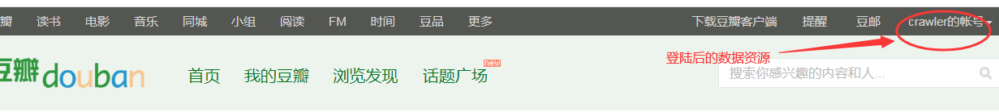
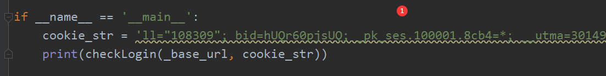
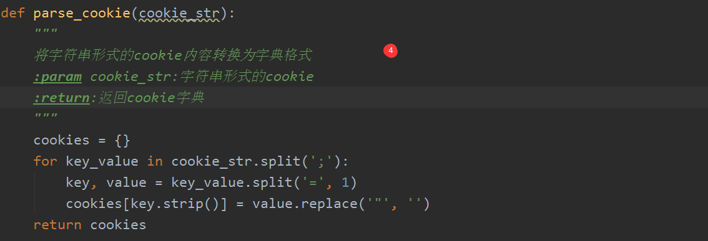
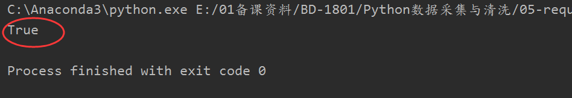
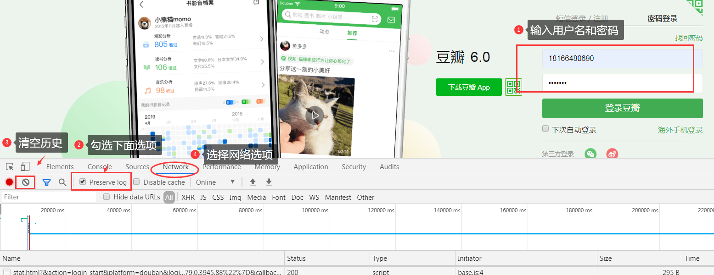
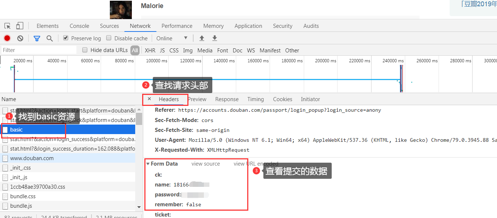
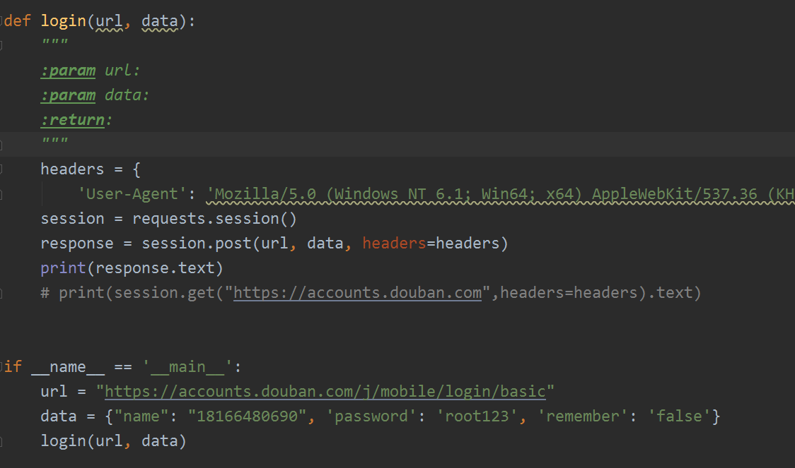
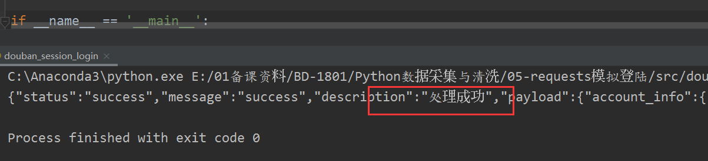

# 验证登陆机制

## cookie机制

## session机制

# 实训主题

## 使用cookie访问豆瓣登陆后资源

### 任务描述

在代码中模拟cookie请求，检测是否能访问豆瓣中已经登陆的数据

### 思路分析

- 在豆瓣网先登陆
- 将豆瓣网中的cookie信息保存到请求headers中
- requests模拟发起请求
- 检测是否能访问到登陆后的信息

### 实现过程

- 定义一个检测函数，传入url和cookie字符串
- 先将cookie字符串解析成字典以备请求时传入cookie参数
- 发起requests请求，传入headers参数和cookies参数
- 返回响应，检测是否包含用户数据

### 实现结果

## 模拟登陆豆瓣

### 任务描述

上面是咱们手动登陆后然后去浏览器中找到cookies进行数据访问，那么如何通过自己写代码模拟手工登陆呢？

### 登陆过程分析

- 表单中输入用户名和密码点击登陆，结合浏览器找到对应的发起请求

- 点击  “登陆豆瓣”  分析请求页面查看对应的表单数据

### 实现分析

使用requests会话对象模拟登陆

- 初始化一个requests会话对象，并添加请求头部
- 准备post参数发起post请求
- 响应数据检测是否登陆成功

### 实现过程

### 实现结果

