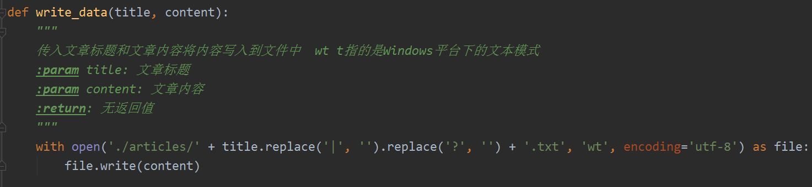
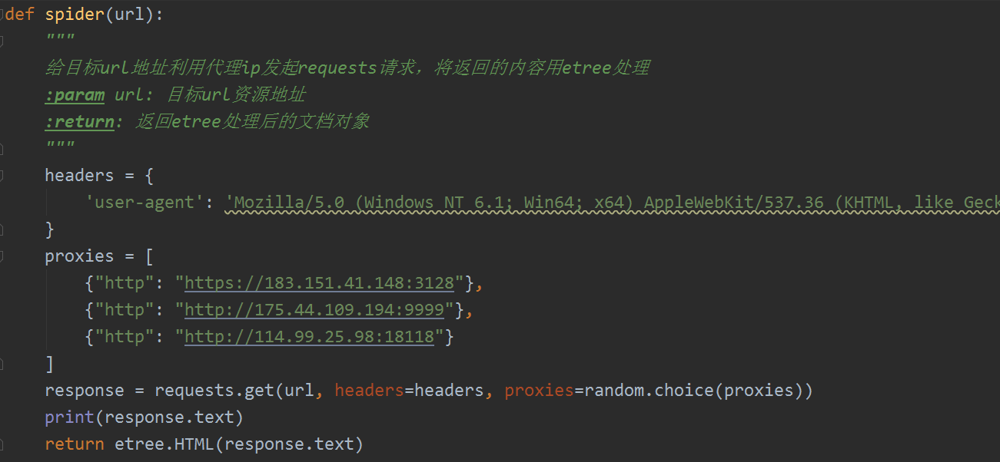
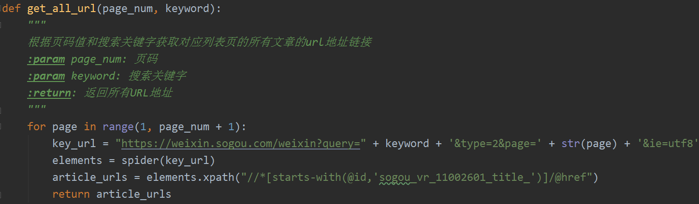
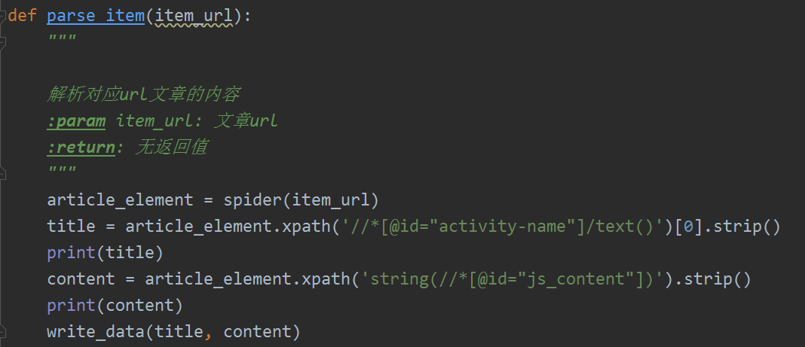
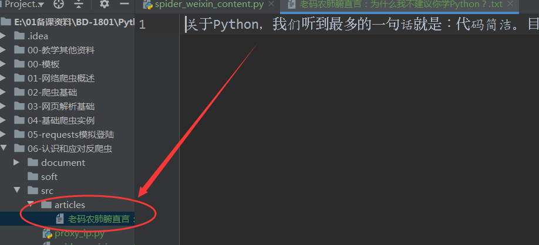

# 常用的网站反爬虫策略及应对措施

## 常用反爬虫策略

- 通过headers反爬虫
- 基于用户行为反爬虫
- 采用动态页面反爬虫

## 应对反爬虫措施

- 为爬虫设置headers
- 使用IP代理
- 控制请求间隔时间
- 使用Selenium框架 

# 使用IP代理的方法

## Requests中使用代理IP

在requests发起get请求时可以指定代理ip

```
requests.get(url, headers=headers, proxies=proxies)
```

其中上面的proxies就是对应的代理ip，一般以字典格式给出，可以是一个也可以是一组

```
proxies = {'http': 'http://180.122.147.97:20694'}
```

## 获取免费代理IP

我们可以在网络中找到临时的免费代理IP作为学习使用

网址：https://www.xicidaili.com/nn


# 实训主题

## 使用IP代理爬取微信文章

### 任务描述

使用requests库、lxml结合ip代理采集微信搜索文章，将采集到的内容写入到文本文件

[微信搜索](https://weixin.sogou.com/)

### 思路分析

- 1.分析微信文章搜索url链接
- 2.根据url链接的规律找到对应关键字对应页码的列表页所有文章url地址
- 3.根据url地址采集对应的标题和内容
- 4.将采集的内容写入磁盘中

### 实现过程

- 1.函数一 编写一个函数将内容写入硬盘文件中
- 2.函数二 编写一个函数接收url地址采用临时代理ip发起请求返回etree处理后的对象
- 3.函数三 编写一个函数接收搜索关键字和页码值返回列表页所有url地址
- 4.函数四 编写一个函数解析文章详细内容，将得到的内容传给函数一写入文件









### 实现结果



### 注意事项（难点）

在获取到列表页链接后，直接获取不到文章信息，由于在搜狗微信中采用了发爬虫技术，利用js对链接部分参数进行了加密且链接做了跳转，此时需要利用抓包工具分析链接http请求重新构建目标真实文章链接。

这里可以运用fiddler抓包工具进行分析

- 下载安装fiddler工具
- 配置参数使其可以抓取https链接
- 分析列表页链接  /link?....
- 分析js加密参数
- 获取真实文章链接

解决方案参考网址：https://www.cnblogs.com/hyonline/p/11812977.html

