# 动态网页的采集

## 什么是动态网页

- 理解ajax，局部刷新
- url地址不变，内容局部变化
- 网页结构不变，但是内容变化

## 如何采集动态网页

- 查找真实的实际请求的url地址
- 使用Selenium模拟浏览器行为

## Selenium库的安装使用

### 检测是否已安装Selenium库

使用以下两条命令均可检测是否已经安装Selenium库

```
pip show selenium   查看是否有版本信息
pip list   查看安装列表中是否有selenium库
```


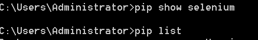

### 安装Selenium

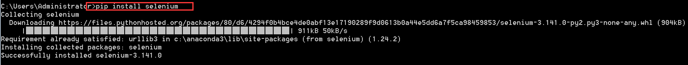

### 下载安装chromedriver

Selenium的使用需要使用chromedriver来驱动chrome浏览器，根据对应的chrome版本选择合适的chromedriver版本。

查看自己的chrome浏览器的版本：

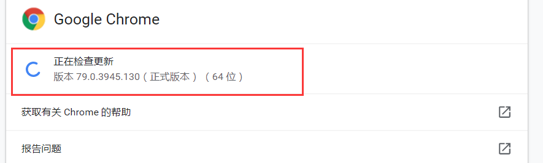

下载对应的chromedriver版本，下载地址[http://npm.taobao.org/mirrors/chromedriver/]

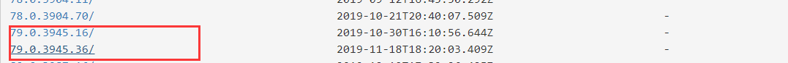

### Selenium的简单使用

- 导入Selenium，启动驱动器

  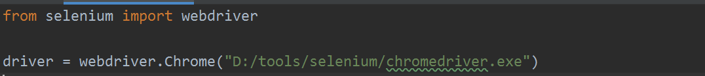

  运行效果：

  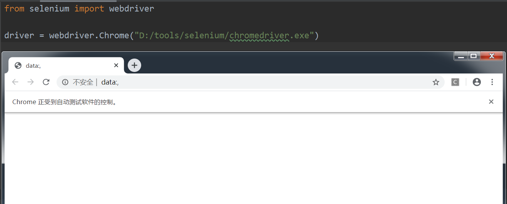

- 使用webdriver打开百度首页

  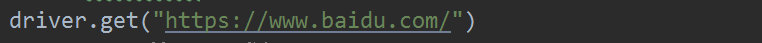

- 使用xpath找到搜索框

  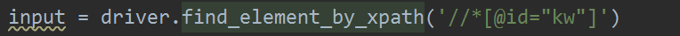

- 找到搜索框键入关键字

  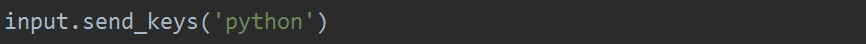

- 模拟点击按钮

  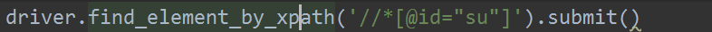

# 实训主题

## 采集链家经纪人数据

### 任务描述

将链家的动态经纪人数据采集到并写入csv文件中

### 思路分析

- 1.分析链接，链家经纪人会根据页面下拉发起新的链接请求，分析链接
- 2.根据需求构建对应的请求url链接地址
- 3.发起请求返回数据并解析
- 4.写入文件

### 实现过程

- 1.定义一个函数实现将列表数据写入csv文件
- 2.定一个函数接收链接地址并返回json对象
- 3.定义一个函数发起请求解析得到的数据并调用1中的函数写入文件

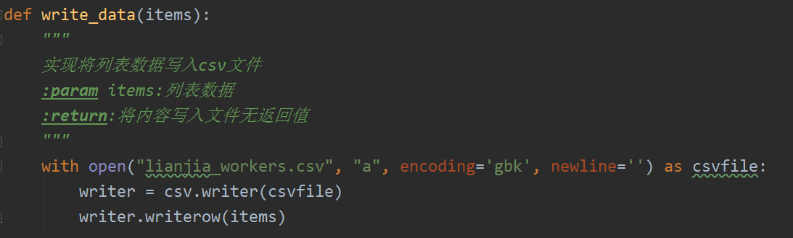

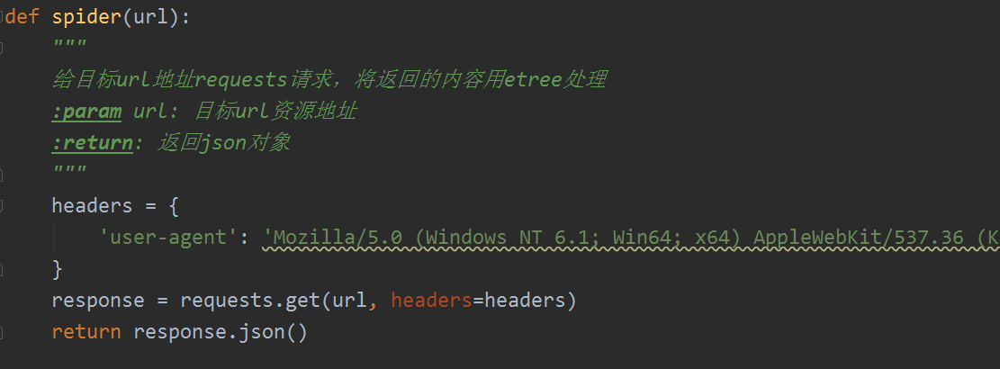

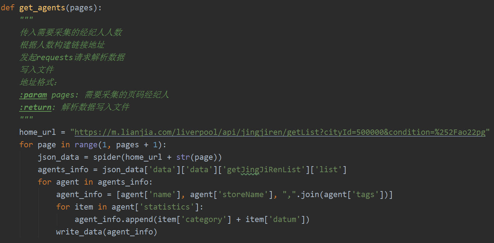

### 实现结果

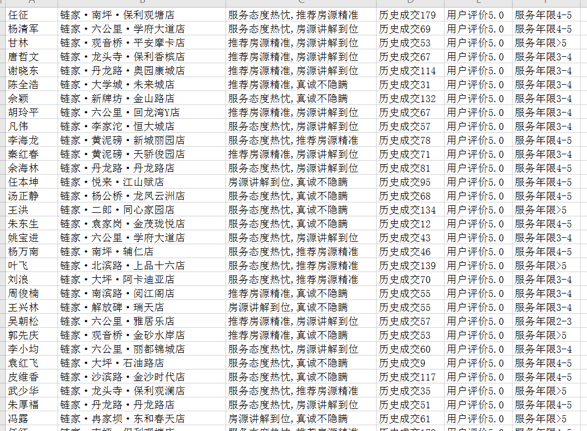

## 简单使用Selenium模拟百度搜索

### 任务描述

```
需求：用Selenium模拟一次手动打开百度首页，键入python关键字进行搜索
```

### 思路分析

- 导入Selenium，启动驱动器
- 使用webdriver打开百度首页
- 使用xpath找到搜索框
- 找到搜索框键入关键字
- 模拟点击按钮

### 实现过程

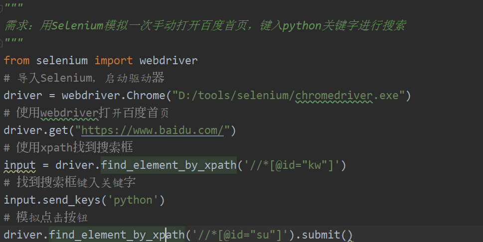

### 实现结果

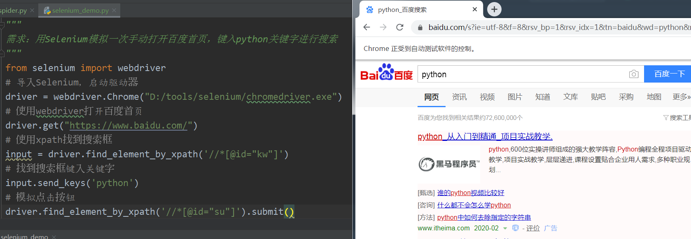

## 采集新浪微博数据

### 任务描述

使用Selenium库登陆微博账号，然后采集自己发布过的微博数据，并写入到文件中。

### 思路分析

- 1.编写落地csv文件函数
- 2.编写登陆新浪微博函数
- 3.编写爬取 解析自己发布的微博内容

### 实现过程 

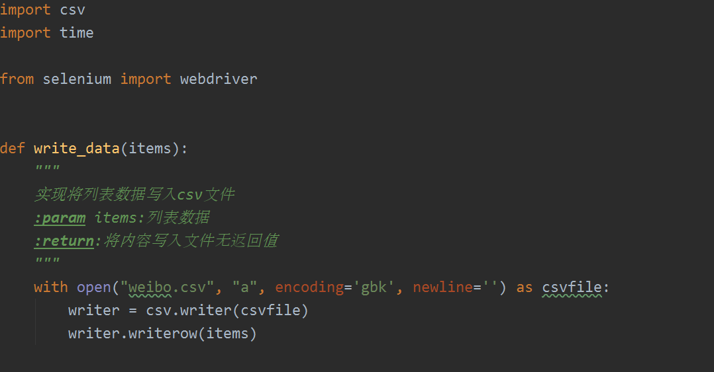

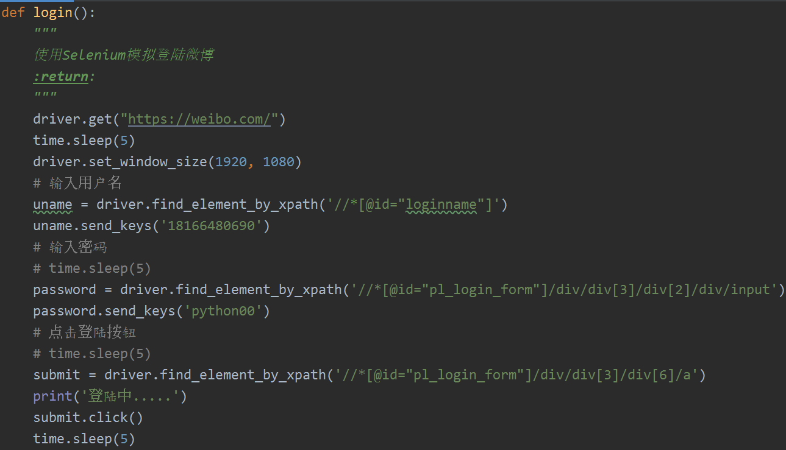

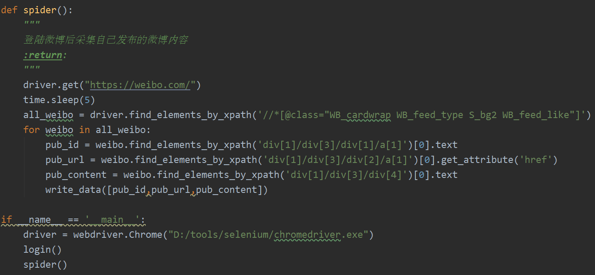

### 实现结果


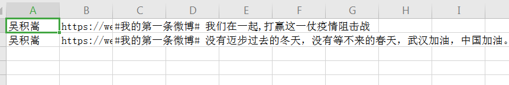

