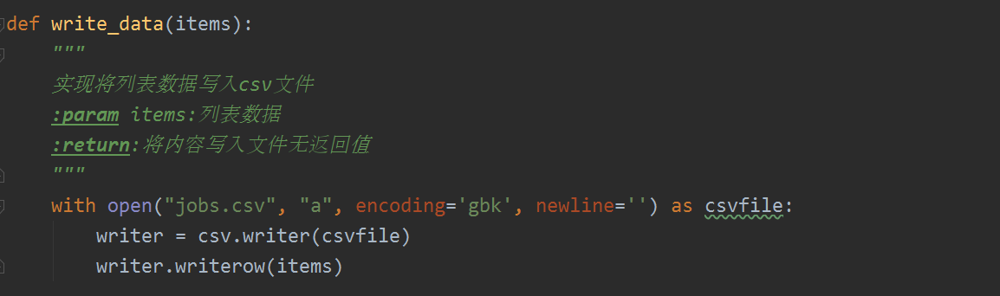
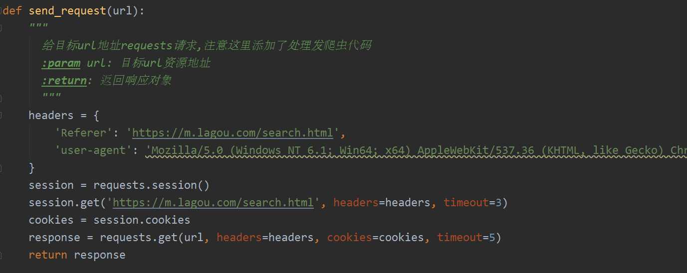
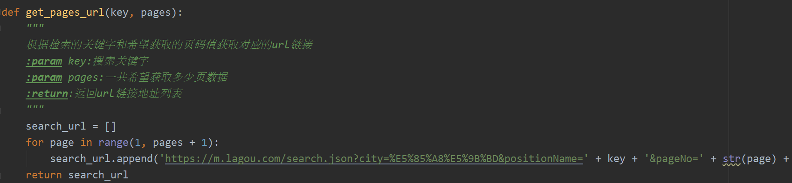
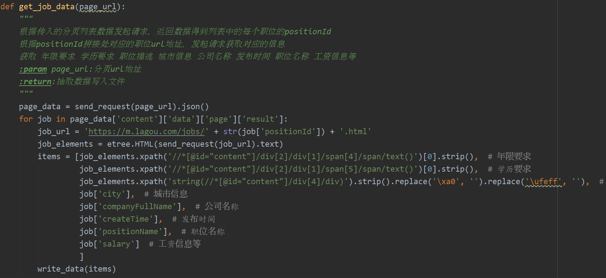
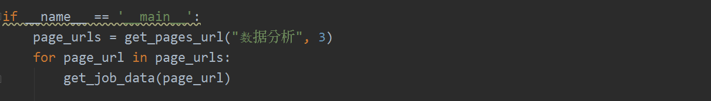
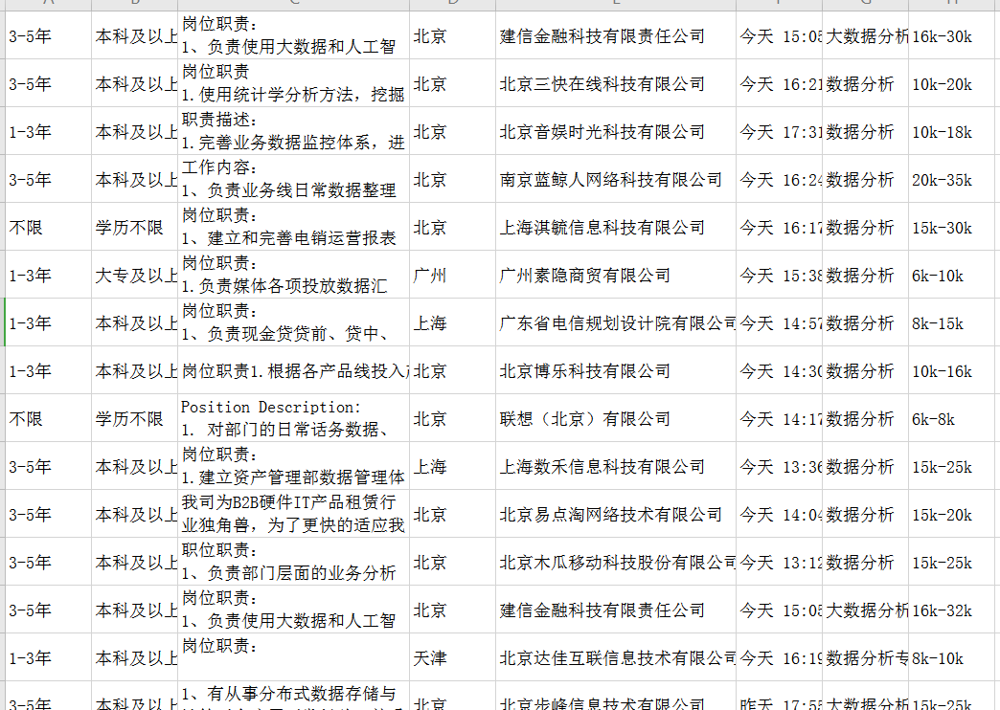

# 实训主题

## 拉勾网职位数据采集

### 任务描述

采集拉勾网移动端对应检索职位的数据采集

获取 年限要求 学历要求 职位描述 城市信息 公司名称 发布时间 职位名称 工资信息等

将采集的数据保存到csv文件中

### 思路分析

- 1.分析拉勾网移动端动态数据的获取链接url地址
- 2.根据对应的数据请求地址发起请求返回对应的json数据
- 3.当拿到对应的职位列表数据后从中抽取对应的positionId构建详情页url地址
- 4.请求详情页url地址内容，解析对应的目标数据进行csv写入数据
- 5.解决反爬虫问题

### 实训过程

- 1.编写写入csv数据函数
- 2.根据传入的关键字和页码数字构建对应的列表页url地址
- 3.对列表页url地址发起请求处理返回数据发起详情页请求并抽取数据，写入数据

### 实现结果

### 注意事项

注意反爬虫问题：    直接请求数据连接时不能正常返回数据，因为反爬虫      

解决方案：每次请求带上第一次方法初始页面的cookie并设置Referer值

