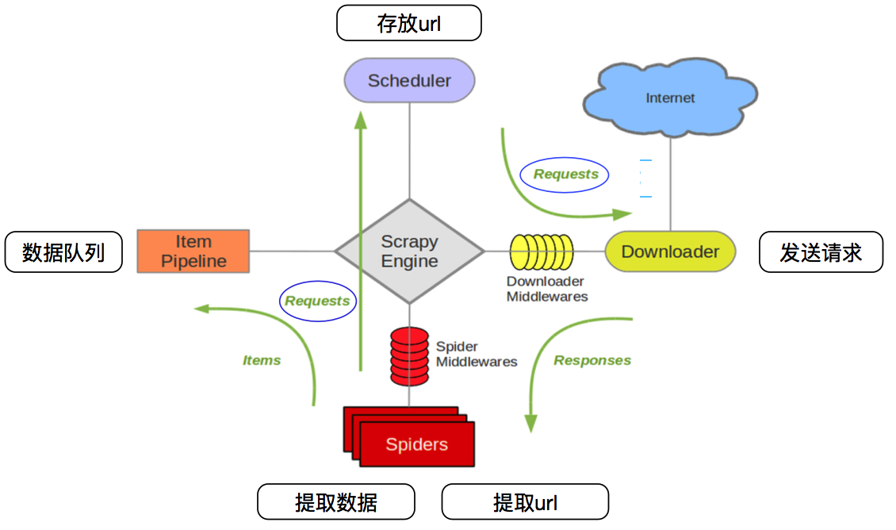

# Scrapy爬虫框架入门

## Scrapy框架简介

Scrapy是一个为爬取网站数据、提取结构性数据而设计的应用程序框架，它可以应用在广泛领域：Scrapy 常应用在包括数据挖掘，信息处理或存储历史数据等一系列的程序中。通常我们可以很简单的通过 Scrapy 框架实现一个爬虫，抓取指定网站的内容或图片。

## Scrapy框架架构



- crapy Engine(引擎): 负责Spider、ItemPipeline、Downloader、Scheduler中间的通讯，信号、数据传递等。
- Scheduler(调度器): 它负责接受引擎发送过来的Request请求，并按照一定的方式进行整理排列，入队，当引擎需要时，交还给引擎。
- Downloader（下载器）：负责下载Scrapy Engine(引擎)发送的所有Requests请求，并将其获取到的Responses交还给Scrapy Engine(引擎)，由引擎交给Spider来处理。
- Spider（爬虫）：它负责处理所有Responses,从中分析提取数据，获取Item字段需要的数据，并将需要跟进的URL提交给引擎，再次进入Scheduler(调度器)。
- Item Pipeline(管道)：它负责处理Spider中获取到的Item，并进行进行后期处理（详细分析、过滤、存储等）的地方。
- Downloader Midlewares（下载中间件）：你可以当作是一个可以自定义扩展下载功能的组件。
- Spider Middlewares（Spider中间件）：你可以理解为是一个可以自定扩展和操作引擎和Spider中间通信的功能组件（比如进入Spider的Responses;和从Spider出去的Requests）。


## Scrapy框架安装

直接在命令行下运行pip install scrapy 即可，如在安装过程中有错误，根据具体的错误提示进行排查：


验证是否安装成功：


## Scrapy目录结构说明

使用Scrapy创建基基础项目结构：

```
scrapy startproject hello_scrapy
```


创建项目后查看具体目录结构：


1）scrapy.cfg: 项目的配置文件，现在可以先忽略。

2）hello_scrapy/: 该项目的python模块。

3）hello_scrapy/items.py: 项目中的item文件。

       Item 是保存爬取到的数据的容器；其使用方法和python字典类似， 并且提供了额外保护机制来避免拼写错误导致的未定义字段错误。

​     可以通过创建一个 scrapy.Item 类， 并且定义类型为 scrapy.Field 的类属性来定义一个Item。

4）hello_scrapy/pipelines.py: 项目中的pipelines文件。

      Scrapy提供了pipeline模块来执行保存数据的操作。在创建的 Scrapy 项目中自动创建了一个 pipeline.py 文件，同时创建了一个默认的 Pipeline 类。比如我们要把item提取的数据可以保存到mysql数据库。

5）hello_scrapy/settings.py: 项目的设置文件。

     settings.py是Scrapy中比较重要的配置文件，里面可以设置的内容非常之多。

6）hello_scrapy/spiders/: 放置spider代码的目录。

## Scrapy框架使用步骤

第一步：创建项目

第二步：创建爬虫

第三步：创建目标数据字段

第四步：创建爬取逻辑

第五步：运行爬虫测试

# 实训主题

## Scrapy爬取百度首页

### 任务描述

使用Scrapy框架完成对百度首页的标题和对应的url地址。

### 思路分析

利用框架Scrapy按照对应的步骤进行实现。

### 实现过程

第一步：创建基础项目

```
scrapy startproject spiders
```


第二步：创建基于BasicSpider模板的爬虫文件

```
cd spiders
scrapy genspider baidu baidu.com
```


第三步：定义需要爬取的目标数据


第四步：使用选择器xpath编写采集业务逻辑


第五步：运行爬虫程序，是否能正常采集到

```
scrapy crawl baidu
```


### 实现结果


